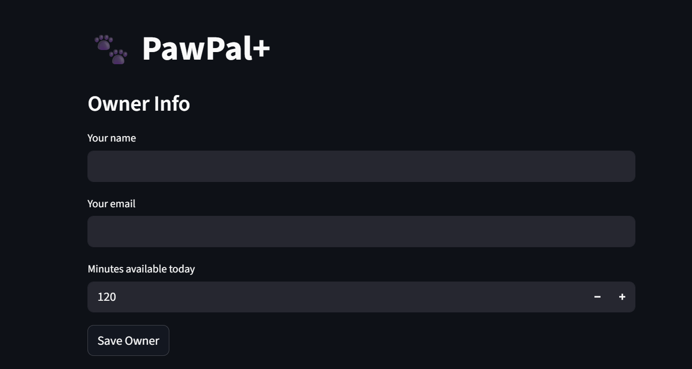

# 🐾 PawPal+

A Streamlit app that helps pet owners plan and manage daily care tasks.

## Features

- Add owner and pet info
- Add tasks with priority, duration, time, and frequency
- Sort tasks chronologically
- Filter tasks by pet or completion status
- Detect scheduling conflicts
- Auto-generate recurring daily and weekly tasks

## 📸 Demo

<a href="pawpal.png" target="_blank">
</a>


## Setup
```bash
python -m venv .venv
source .venv/bin/activate
pip install -r requirements.txt
streamlit run app.py
```

## Testing PawPal+
```bash
python -m pytest
```

Tests cover task completion, sorting, conflict detection, recurring tasks,
and edge cases like pets with no tasks.

Confidence level: ⭐⭐⭐⭐